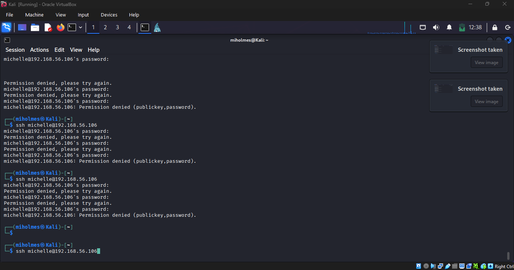
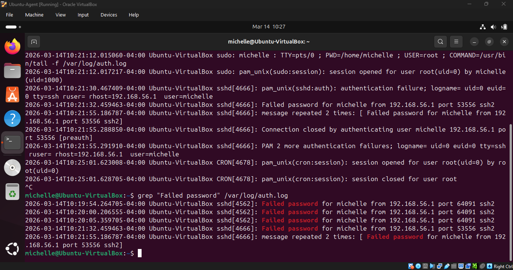
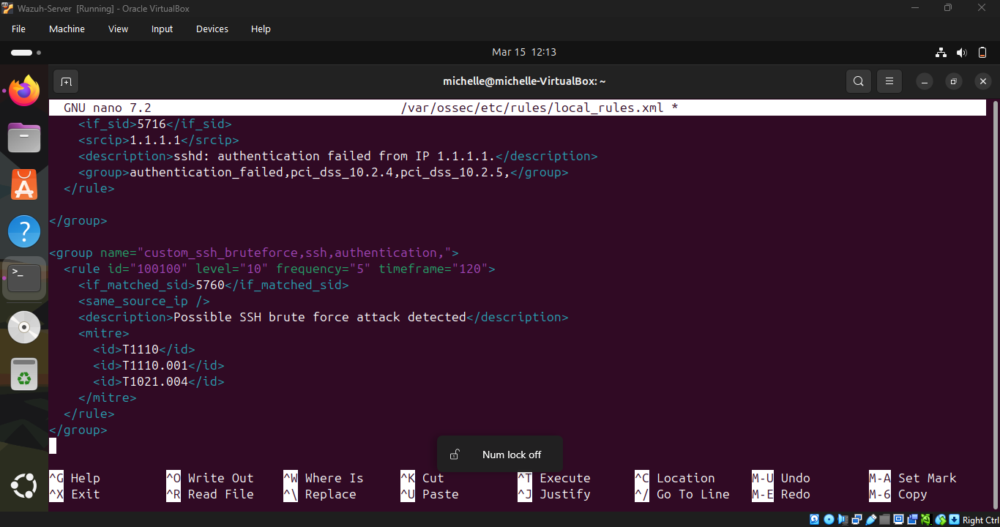
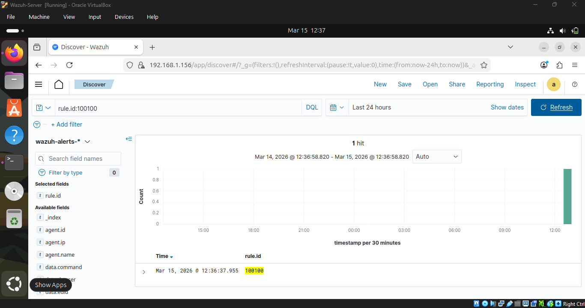

# SSH Brute Force Detection Use Case

## Detection Objective

Detects repeated SSH authentication failures that may indicate a brute force attack attempting to guess valid credentials on a Linux system.

This detection is designed to identify suspicious login activity originating from a single source IP (in this case IP `192.168.56.104`) generating multiple failed authentication attempts within a short time window.

---

## Detection Strategy

The detection focuses on authentication failures recorded in the Linux authentication logs.

Repeated failed login attempts originating from the same IP address are correlated to identify potential credential brute-force behavior.

Indicators include:

- Multiple **Failed password** events
- High frequency authentication attempts
- Repeated attempts against the same account
- Consistent source IP address

---

## Log Sources

| Log Source | Description |
|------------|-------------|
| `/var/log/auth.log` | Linux authentication events including SSH login attempts |
| Ubuntu Agent | Collects and forwards authentication telemetry to the SIEM |
| Wazuh SIEM | Correlates events and triggers detection alerts |

---

## Detection Logic

The detection rule monitors SSH authentication failures and triggers an alert when repeated failures occur from the same source IP.

### Rule Conditions

- Event contains **"Failed password"**
- SSH authentication attempt detected
- Multiple failures from the same source IP
- Activity occurs within a defined time window


```
Example logic:
IF:
 5 or more failed SSH login attempts
 FROM the same source IP
 WITHIN 2 minutes
THEN:
 Trigger alert → Potential SSH brute force attack
```

---

## MITRE ATT&CK Mapping

| Tactic | Technique | ID |
|------|------|------|
| Credential Access | Brute Force | T1110 |
| Credential Access | Password Guessing | T1110.001 |
| Lateral Movement | Remote Services: SSH | T1021.004 |

---

## Detection Validation

The detection rule was validated by simulating repeated SSH authentication attempts from a Kali Linux attacker VM targeting the Ubuntu endpoint monitored by Wazuh.

The attacker system initiated multiple SSH login attempts against the Ubuntu endpoint using the following command:
`ssh michelle@192.168.56.106`


Multiple incorrect passwords were intentionally entered in order to generate repeated authentication failures.

### Attack Simulation

The repeated login attempts produced multiple authentication failure events. These failures represent the behavior expected during an SSH brute force attempt where an attacker repeatedly guesses credentials.



### Endpoint Log Evidence

The failed authentication attempts were recorded in the Linux authentication log:
`/var/log/auth.log`

Example log entry:

```
Failed password for michelle from 192.168.56.104 port 41556 ssh2
```


These authentication failures were collected by the **Wazuh agent** running on the Ubuntu endpoint and forwarded to the Wazuh manager for analysis.



### Detection Rule Deployment

A custom Wazuh correlation rule was created within the manager configuration to detect repeated SSH authentication failures originating from the same source IP.

The rule monitors for authentication failure events and triggers when the threshold condition is met.





Example rule configuration:
```xml
<rule id="100100" level="10" frequency="5" timeframe="120">
  <if_matched_sid>5760</if_matched_sid>
  <same_source_ip />
</rule>
```

This rule triggers when:

- **5 authentication failures**
- originate from the **same source IP**
- within a **120 second window**

---

### Alert Generation

After the attack simulation was performed, the Wazuh SIEM successfully generated a detection alert indicating a potential SSH brute force attack.

The alert included the following details:

Rule ID: 100100

Rule Level: 10

Description: Possible SSH brute force attack detected

Source IP: 192.168.56.104

Target Account: michelle



---

## Validation Result

The simulated attack generated repeated authentication failures which were successfully ingested by the Wazuh SIEM.

Once the defined threshold was reached, the custom correlation rule triggered a detection alert. This confirms that the detection logic is capable of identifying repeated SSH authentication failures consistent with brute force credential guessing behavior.

## Tuning Considerations

To reduce false positives in production environments, detection thresholds may require adjustment. 
Potential tuning strategies include:

- Adjusting the failed login threshold
- Increasing or decreasing the time window
- Excluding trusted administrative IP ranges
- Monitoring login attempts against privileged accounts separately

## Detection Outcome

This detection rule provides early visibility into SSH brute force activity targeting Linux systems. When combined with endpoint telemetry and SOC investigation workflows, this detection enables analysts to identify credential guessing attacks and respond before unauthorized access is achieved.
